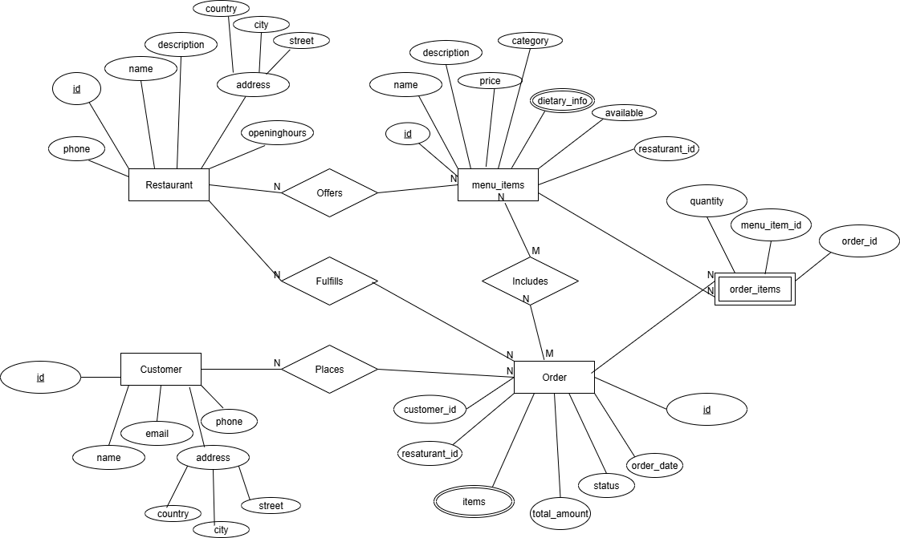

# Foodie-Hub

A full-stack web application for managing restaurants, menus, and customer orders.  
Built with Node.js, Express, and PostgreSQL, Foodie-Hub offers a clean API to handle restaurant data, customer orders, and menu management with features like pagination, filtering, and status tracking. This is only for practice and has no real world use.

## Features

- Add, view, and manage restaurants
- Add and manage menu items for each restaurant
- Place orders and track order status
- Organized database schema using PostgreSQL
- Follows MVC architecture
- RESTful API routes

## Tech Stack

- **Backend**: Node.js, Express.js
- **Database**: PostgreSQL
- **Database Driver**: pg (node-postgres)

---

## 🛠️ Getting Started — Run Locally

### 1. Clone the repository

```bash
git clone https://github.com/elhamatokhi/foodie-hub.git
cd foodie-hub

```

### 2. Install dependencies

```bash
npm install
```

### 3. Configure environment variables

Create a .env file at the root and add your PostgreSQL connection details:

```bash
PGHOST=localhost
PGUSER=your_db_username
PGPASSWORD=your_db_password
PGDATABASE=foodie_hub
PGPORT=5432

```

### 4. Setup the database

Make sure PostgreSQL is running. Then create the database and tables:

```bash
createdb foodie_hub
psql -d foodie_hub -f schema.sql

```

### 5. Start the server

```bash
npm start
```

Visit http://localhost:3000 to access the API.

---

# 📦 Database Setup

The schema.sql file contains all the SQL commands needed to create the database tables with appropriate relationships and constraints.

Run it with:

```bash
psql -d foodie_hub -f schema.sql
```

This creates:

- restaurants table

- menus table

- customers table

- orders table (with order status enum)

- necessary foreign keys and indexes

---

# 📡 API Endpoints & Usage Examples

# API Endpoints

## Restaurants

- `GET /restaurants` — View all restaurants
- `POST /restaurants` — Add a new restaurant
- `PUT /restaurants/:id` — Update a restaurant
- `DELETE /delete/:id` — Delete a restaurant

## Menu Items

- `POST /restaurants/:id/menu` — Add menu item to a restaurant
- `GET /restaurants/:id/menu` — Get menu items of a restaurant
- `PUT /menu/:id` — Update a menu item
- `DELETE /deleteMenu/:id` — Delete a menu item
- `GET /menuItems` — Get all menu items

## Customers

- `GET /customers` — Get all customers
- `POST /customers` — Add a customer
- `PUT /customers/:id` — Update a customer
- `DELETE /deleteCustomer/:id` — Delete a customer

## Orders

- `GET /orders` — Get all orders (with optional pagination and filtering)
- `POST /orders` — Add a new order
- `GET /orders/customer/:id` — Get all orders for a specific customer
- `PUT /orders/:id` — Update an order
- `DELETE /orders/:id` — Delete an order

### Usage Examples - Create an order

```bash
curl -X POST http://localhost:3000/orders \
  -H "Content-Type: application/json" \
  -d '{
    "order_date": "2025-08-01",
    "total_amount": 35.50,
    "status": "pending",
    "customer_id": 3,
    "restaurant_id": 1
  }'
```

## EER Diagram

Here is the Entity-Relationship Diagram (EER) for the database schema:


